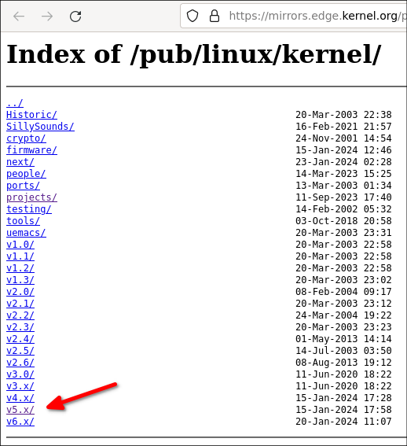
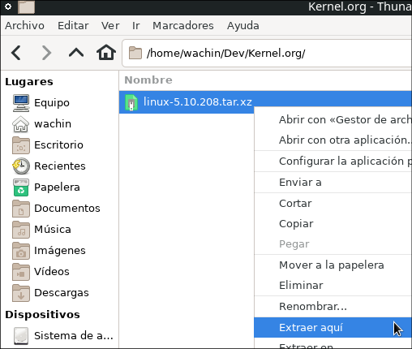

# Compilando un Kernel y personalizarlo en Linux

**TUTORIAL EN CONSTRUCCIÓN**


### Porqué compilar un Kernel para personalizarlo?

Deseo compilar un Kernel y personalizarlo porque tengo un ordenador de pocos recursos y voy a compilar el Kernel desabilitando la Virtualización y otros para alijerar el Kernel

Este tutorial lo estoy haciendo en MX Linux 21, pero lo puede usar en cualquier Linux basado en Debian, y podría adaptarlo para Ubuntu u otro Linux.

### Añadir el nombre del Mantenedor o Responsable a su Sistema para que se compile con ese nombre (Opcional)

Esta parte es totalmente opcional, no es necesario para compilar el Kernel, pero si lo hace una vez instalado el Kernel al revisarlo en Synaptic se verá allí su nombre y su correo, para hacerlo lo más fácil es hacer visibles a los archivos ocultos con Ctrl + H y darle clic derecho y abrir con algún editor de texto al archivo oculto:

.bashrc


en la siguiente imagen está abierto con Gedit:


 y allí debe de poner lo siguiente:

DEBEMAIL="your.email.address@example.org"  
DEBFULLNAME="Firstname Lastname"  
export DEBEMAIL DEBFULLNAME  

y cambiar con sus datos.  

A mi me queda así: 


ahora guardo y cierro el editor de texto y cierro sesión y vuelo a entrar en el ordenador. 

# ¿Qué versión de Kernel está instalado en mi Sistema Operativo?

Primero debe saber qué kernel trae su distrubución para tener una idea de qué Kernel debe compilar, pongo en la terminal:

`uname -r` 

y me da:

5.10.0-20-amd64

entonces sé que si instalo una versión como esa debería de funcionar, o sea esto es para tener una idea

# Instalar dependencias

Debemos instalar las siguientes dependencias para poder compilarlo:

```
sudo apt-get install libncurses5-dev fakeroot wget xz-utils flex bison libssl-dev
```

**Nota:** Es posible que con el paso del tiempo se necesite alguna otra dependencia lo cual deberán de consultando con la información de error que les dé mientras lo compilan.

# Elegir la versión del código fuente del Kernel a Compilar

Ahora es necesario ver cual Kernel se podría instalar, y es necesario saber que en la siguiente página ellos tienen los Kernel con Soporte de Largo Plazo (LTS) y nos conviene usarlos pues los mantienen actualizados en cuantos a seguridad. Diríjase a:

**Longterm release kernels**
[https://www.kernel.org/category/releases.html](https://www.kernel.org/category/releases.html)

La siguiente captura de pantalla la hago con la fecha Enero 2024


**Nota**: Si no sepan Inglés les aconsejo que la traduzcan en [Google Traductor](https://translate.google.com/)

Allí encuentro y copio la siguiente información:

```
Version 	Maintainer 	Released 	Projected EOL
6.6 	Greg Kroah-Hartman & Sasha Levin 	2023-10-29 	Dec, 2026
6.1 	Greg Kroah-Hartman & Sasha Levin 	2022-12-11 	Dec, 2026
5.15 	Greg Kroah-Hartman & Sasha Levin 	2021-10-31 	Dec, 2026
5.10 	Greg Kroah-Hartman & Sasha Levin 	2020-12-13 	Dec, 2026
5.4 	Greg Kroah-Hartman & Sasha Levin 	2019-11-24 	Dec, 2025
4.19 	Greg Kroah-Hartman & Sasha Levin 	2018-10-22 	Dec, 2024
```

entonces lo más seguro es que funcione una versión:

5.10
en adelante, porque esa está con la feha 2020.

# Buscar el código fuente correcto

La preguna importante es con qué criterio debo buscar el código fuente del Kernel? Debemos tener muy en cuenta la fecha en que compramos nuestro ordenador y de acuerdo a eso buscar el codigo fuente del Kernel

En mi caso el ordenador es del 2009 y debo usar la versión mas antigua del Kernel pero que se pueda instalar en el Linux que estoy usando y que esté actualizado

Me dirijo a:

**Linux Kernel**  
[https://mirrors.edge.kernel.org/pub/linux/kernel/](https://mirrors.edge.kernel.org/pub/linux/kernel/)

allí dentro busco el:

v5.x



**Nota:** También luego intentaré con el v4.x porque tal vez pueda funcionar.

y allí encuentro:

[https://mirrors.edge.kernel.org/pub/linux/kernel/v5.x/](https://mirrors.edge.kernel.org/pub/linux/kernel/v5.x/)

y allí dentro busco un código fuente con el nombre:

Linux 5.10. . 

y elijo el siguiente:


con la fecha actual que en este caso es 2024 y .tar.xz porque ocupa menos espacio:

linux-5.10.208.tar.xz                              15-Jan-2024 17:53    115M

y el siguiente es el enlace que lo copio de allí:

https://mirrors.edge.kernel.org/pub/linux/kernel/v5.x/linux-5.10.208.tar.xz

**Nota:** Con el paso del tiempo es posible que este archivo ya no esté disponible porque lo actualizán en los Kernel LTS (cuando encuentran una vulnerabilidad la corrigen)

# Descargandolo con wget

Primero les aconsejo que hagan la descarga en alguna carpeta para este proposito en algún lugar y allí abran una terminal y pongan ejemplo par mi caso es:

**Kernel**

    wget -c https://mirrors.edge.kernel.org/pub/linux/kernel/v5.x/linux-5.10.208.tar.xz

y extraer el contendio del Kernel



# Configurando el Kernel
Entrar en la carpeta del Kernel y abrir una terminal allí:


y poner allí en la terminal:

`make menuconfig`


y al dar ENTER aparecerá la configuración del Kernel:


## VERIFICANDO SOPORTE EXFAT (OPCIONAL)

Yo utilizo particiones exFAT y si este Kernel no tiene soporte tendría que instalarselo, para verificar si tiene entro en la carpeta:

fs

la cual es la abreviación de File System


allí dentro en este kernel está la carpeta:

exfat


también en el menú de las configuraciones del Kernel se puede revisar en:

**File Systems ---> DOS/FAT/exFAT** 

 

y doy ENTER y con la flecha hacia abajo busco:


y este Kernel si tiene:


ahora retrocedo con Esc dos veces hasta llegar al inicio.

y dar Enter, y cuando dice Ok dar Enter otra vez


Ahora con Tab o flecha derecha llegar hasta Exit y dar Enter:


y enter en la nueva configuración:


## ELEGIR LA VELOCIDAD DE COMPILACIÓN

Este paso es opcional, podemos exportar el nivel de concurrencia para la compilación *(Concurrencia es la acción de concurrir distintos  sucesos o cosas en un mismo lugar o tiempo)*, para esto existen las siguientes opciones dependiendo de la cantidad de procesadores que usted tenga, para esto hay una regla la de agregar el número uno al número de núcleos que tenga su procesador, ejemplo:

 

Si usted tenga 2 núcleos debe poner
export CONCURRENCY_LEVEL=3

Si usted tenga 4 núcleos debe poner
export CONCURRENCY_LEVEL=5

 

Así, mi laptop es una Dell Inspiron 1750 y tiene dos núcleos así que yo debo de poner así:

```
export CONCURRENCY_LEVEL=3
```

esto es para que la compilación no se demore mucho

 

#### Compinado el Kernel etiquetandolo  

Es  posible Compilar el Kernel y ponerle una etiqueta como descripción, en el siguiente ejemplo en LOCALVERSION= está la etiqueta  wachin:

```
make deb-pkg LOCALVERSION=-wachin KDEB_PKGVERSION=$(make kernelversion)-1
```

si se pone eso en la terminal con esa etiqueta será compilado el Kernel y eso aparecerá al final del nombre del deb

ahora pongo una imagen de lo que sale al poner el comando:

[](https://draft.blogger.com/#)

hay que esperar un buen rato hasta que termine la compilación, pueden ser horas

 . . . . . 

Bueno, ya se compiló, quizá se demoró unas 5 horas en compilar (depende del ordenador), ahora pongo una imágen de cómo me quedó


los dos deb:

linux-headers-5.10.109-rt65avl1-wachin_5.10.109-1_i386.deb
linux-image-5.10.109-rt65avl1-wachin_5.10.109-1_i386.deb

# Instalar el Kernel RT

Esos dos archivos deb son el Kernel, póngalos en una carpeta aparte e instalelos, abra una terminal allí y ponga:

`sudo dpkg -i *.deb`

y si desea los puede compartir en la Web

Si desea puede abrir Synaptic y buscar las palabras:

kernel image

o:

kernel header

y verá su nombre, su correo, y la etiqueta:


make deb-pkg LOCALVERSION=-wachin KDEB_PKGVERSION=$(make kernelversion)-1


salir


**BASADO EN:**  

**Building realtime Linux for ROS 2 [community-contributed] — ROS 2 Documentation: Foxy documentation**  
[https://docs.ros.org/en/foxy/Tutorials/Building-Realtime-rt_preempt-kernel-for-ROS-2.html](https://docs.ros.org/en/foxy/Tutorials/Building-Realtime-rt_preempt-kernel-for-ROS-2.html)

**System configuration [Linux-Sound] ** 
[https://wiki.linuxaudio.org/wiki/system_configuration#do_i_really_need_a_real-time_kernel](https://wiki.linuxaudio.org/wiki/system_configuration#do_i_really_need_a_real-time_kernel)

**Real-Time Linux | Toradex Developer Center ** 
[https://developer.toradex.com/linux-bsp/real-time/real-time-linux/#preempt-rt-patch-set](https://developer.toradex.com/linux-bsp/real-time/real-time-linux/#preempt-rt-patch-set)

**Guide for Debian Maintainers**  
[https://www.debian.org/doc/manuals/debmake-doc/index.en.html](https://draft.blogger.com/#)
**Chapter 3. Tool Setups**  
[https://www.debian.org/doc/manuals/debmake-doc/ch03.en.html#email-setup](https://draft.blogger.com/#)

**The Linux Kernel: The Source Code**  

https://www.linux.org/threads/the-linux-kernel-the-source-code.8679/


